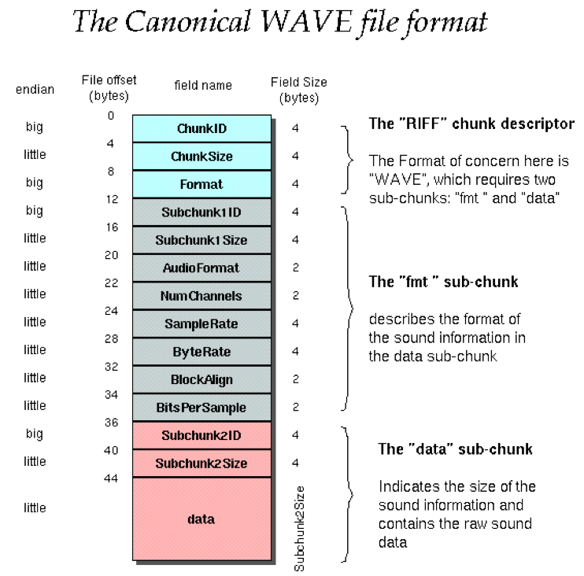

# WavReader

## Wav文件结构

|Positions |	Sample Value |	Description|
|:----------:|:-----------------:|:-------------:|
|1 - 4 |	"RIFF" |Marks the file as a riff file. Characters are each 1 byte long.|
|5 - 8 |	File size (integer) |	Size of the overall file - 8 bytes, in bytes (32-bit integer). Typically, you’d fill this in after creation.|
|9 -12 |	"WAVE" 	|File Type Header. For our purposes, it always equals "WAVE".|
|13-16 |	"fmt " |	Format chunk marker. Includes trailing null|
|17-20 |	16 	| Length of format data as listed above |
|21-22 |	1 	|Type of format (1 is PCM) - 2 byte integer|
|23-24 |	2 |	Number of Channels - 2 byte integer |
|25-28 |	44100 |	Sample Rate - 32 byte integer. Common values are 44100 (CD), 48000 (DAT). Sample Rate = Number of Samples per second, or Hertz.|
|29-32 |	176400 |	(Sample Rate * BitsPerSample * Channels) / 8.|
|33-34 |	4 	|(BitsPerSample * Channels) / 8.1 - 8 bit mono2 - 8 bit stereo/16 bit mono4 - 16 bit stereo|
|35-36 |	16 	|Bits per sample|
|37-40 |	"data" |	"data" chunk header. Marks the beginning of the data section.|
|41-44 |	File size (data) |	Size of the data section. |

## 使用

参考[demo](./src/main/java/luoye/Demo.java)